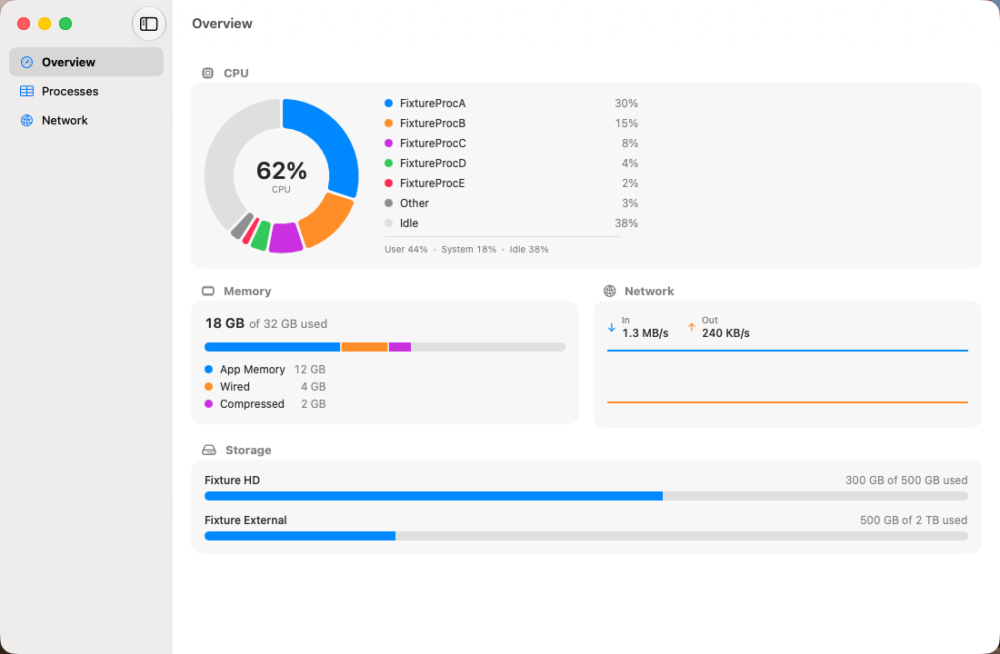
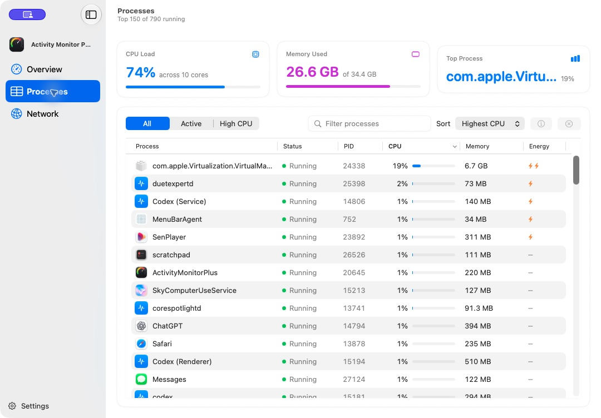
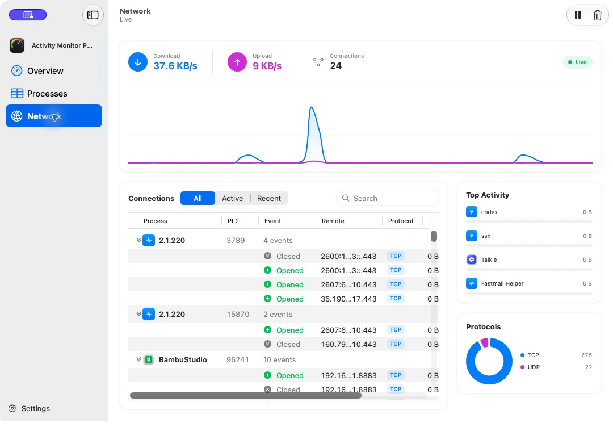

# Activity Monitor Plus

A better macOS system monitor. A native SwiftUI app that leads with a polished
live dashboard for system load, top CPU consumers, memory pressure, storage,
and network throughput — with a rich connection log and a fast, stable process
table behind it.




## Features

- **Overview dashboard (primary view).** A 60-second system-load history with
  an Activity-Monitor-style User / System / Idle split and direct links to the
  busiest processes; memory pressure and composition; interactive per-volume
  storage cards; and live download/upload history.
- **Process dashboard.** Live CPU, memory, and top-process summaries above a
  scoped table sortable by name, PID, %CPU, or memory, with search and native
  application icons where available.
  Values are exponentially smoothed and row order is frozen between periodic
  re-ranks, so the table reads calmly instead of oscillating every second.
  Select any process to **Inspect** it (path, user, parent PID, start time, and
  its recent network activity) or **Quit / Force Quit** it.
- **Network dashboard.** A 60-second throughput chart above a grouped live feed
  of opened, closed, and per-interval traffic events, plus process rankings and
  protocol composition. Pause and clear from the toolbar.
- **Menu bar extra.** A compact companion dashboard with CPU history, memory,
  network rates, and the top three processes without opening the main window.
- **Optional local automation.** Approved local apps can query live system
  status, CPU/process activity, network/process connections, and disk capacity
  through a secure, paired Local MCP producer.
- **Appearance.** Follows the system Light/Dark setting, with a manual override
  in Settings (⌘,).

## Screenshots

| Processes | Network log |
|---|---|
|  |  |

## Architecture

The app is built around a small, testable core and a clean sampling seam.

- **Sampling seam.** Every source of data is a protocol — `CPUSampling`,
  `MemorySampling`, `StorageSampling`, `ThroughputSampling`,
  `ConnectionSnapshotProviding`, `ProcessControlling`. Live implementations read
  the system via `libproc`, Mach host statistics, `getifaddrs`, and `netstat`;
  fixture implementations return deterministic data for tests. A
  `--uitest-fixtures` launch argument swaps the whole set.
- **Sampling loop.** An `actor SamplingCoordinator` runs a 1 Hz loop and
  publishes each `SystemSnapshot` (plus connection events) through an
  `AsyncStream`. A `@MainActor @Observable AppModel` consumes the stream and
  drives the SwiftUI views.
- **Pure core.** The parsing and transformation logic — `NetstatParser`,
  `ConnectionDiffEngine`, `CPUDonutSlices`, `ProcessSmoother`, `StableRanker`,
  `RingBuffer`, `Formatters` — is free of I/O and unit-tested on the host.
- **Local automation seam.** Dedicated Codable wire DTOs and a Sendable bridge
  expose bounded snapshots without making SwiftUI state or sampler models part
  of the Local MCP contract. The app delegate owns producer startup and clean
  shutdown.

```
ActivityMonitorPlus/
├── App/            @main app, AppModel, appearance
├── Models/         snapshots, connection events, ring buffer, donut/table logic
├── LocalMCP/       read-only commands, pairing, grants, producer lifecycle
├── Sampling/       protocols, coordinator, parser, diff engine, live + fixtures
├── Views/          Overview cards, process table, network log, menu bar
└── Support/        formatters
```

## Getting started

**Requirements:** macOS 15+, Xcode with the Swift 6 toolchain, an Apple
Development signing team, and [XcodeGen](https://github.com/yonaskolb/XcodeGen)
(`brew install xcodegen`). The `.xcodeproj` is generated, not committed. Change
`DEVELOPMENT_TEAM` in `project.yml` when building with a different account.

```bash
git clone https://github.com/stevemurr/activity-monitor-plus.git
cd activity-monitor-plus
xcodegen generate
open ActivityMonitorPlus.xcodeproj      # or build from the command line:
xcodebuild -scheme ActivityMonitorPlus -configuration Release build
```

The app is **non-sandboxed** (it reads other processes' statistics and spawns
`netstat`) and uses Apple Development signing for its Keychain access group.

## Local MCP

The [LocalMCPKit](https://github.com/stevemurr/local-mcp-kit) producer is
disabled by default. Enable it under **Settings → Local MCP**. It listens only
on IPv4 loopback and advertises through LocalOnly Bonjour; discovery alone does
not grant access. Every new consumer must be explicitly approved after its
verification code is matched, and grants can be reviewed or revoked in
Settings.

Approved consumers may call four read-only tools:

- `activity_monitor.status` — sample freshness plus CPU, memory, throughput,
  active-connection, process, and disk counts
- `activity_monitor.cpu_processes` — bounded process queries by name/PID, CPU
  threshold, and sort order
- `activity_monitor.network_processes` — bounded live socket and endpoint
  details grouped by process
- `activity_monitor.disks` — mounted-volume capacity and usage information

Network endpoint metadata and process names can be sensitive even though these
tools cannot quit processes or modify files. Pair only with local apps you
trust. Producer grants are stored in the macOS data-protection Keychain under a
team-scoped access group, so authorized consumers remain manageable across app
rebuilds.

## Testing

```bash
# Unit tests — safe to run on the host
xcodebuild -scheme ActivityMonitorPlus test
```

The **UI tests are XCUITest** and take over the real mouse and keyboard while
they run, so they must run inside a VM, never on your host. They assert against
fixture data via the `--uitest-fixtures` launch argument. Compile-checking the
UI-test target on the host is fine:

```bash
xcodebuild -scheme ActivityMonitorPlusUITests build-for-testing
```

## Notes

- **CPU attribution.** Per-process CPU comes from `proc_pid_rusage`, which is
  denied for processes owned by other users (root daemons). Those rows show
  "—" and their usage is still reflected in the donut's "Other" slice, since
  the total comes from Mach host statistics.
- **Process table cap.** SwiftUI's `Table` uses automatic row heights, which
  forces AppKit to realize a view for every row on a reorder. To keep sorting
  and filtering instant, the table renders the top 150 rows by the active sort;
  search still scans every process.
